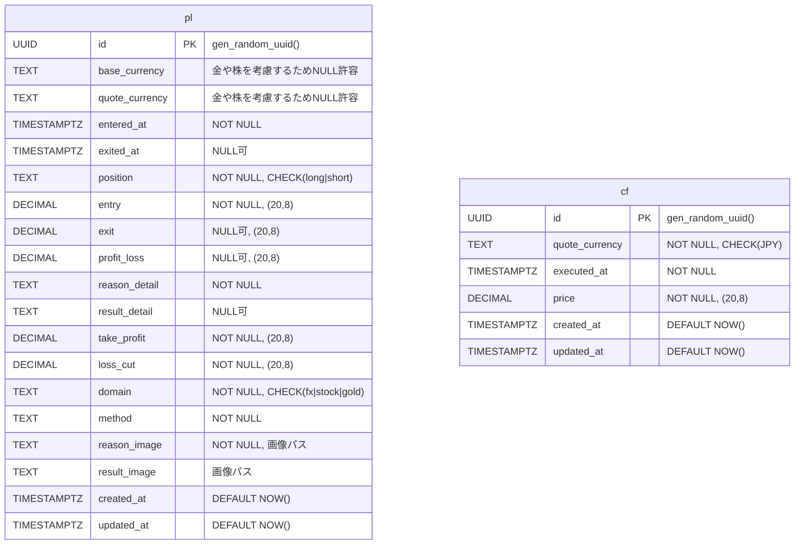

# PLテーブルスキーマ

評価

# 評価値
これまでの投資成果を表示する。
- 累積損益額（25年8月以降のデータのみ使用）
    - 式：plテーブルのprofit_lossの合計(評価額) - cfテーブルのpriceの合計(元本)
- 各月の損益額（25年8月以降のデータのみ使用、かつ直近6ヶ月）
    - 折れ線グラフ
    - 式：plテーブルのprofit_lossの各月の合計(評価額)
- 各月のpips（直近6ヶ月）
    - 折れ線グラフ
    - 式：lib/calc/calculatePipsを使用して、各月
- 手法ごとの勝率（直近3ヶ月）
    - methodごとにprofit_lossがo以上なら勝ち、0未満なら負けとして%で出力
    - 勝率順で上から並べる
    - 分析（%の下に記述）
        - 画面を2分割し、左を成功例、右を失敗例とする
        - 最新のレコード上位3件を上から並べる。
        - 表示する情報はbase_currency、quote_currency、entered_at、exited_at、position、entry、exit、take_profit、loss_cut、加えて、lib/calc/calculatePipsの結果

- データ一括登録処理見直し
- 削除機能
- 画像登録
- レイアウト調整