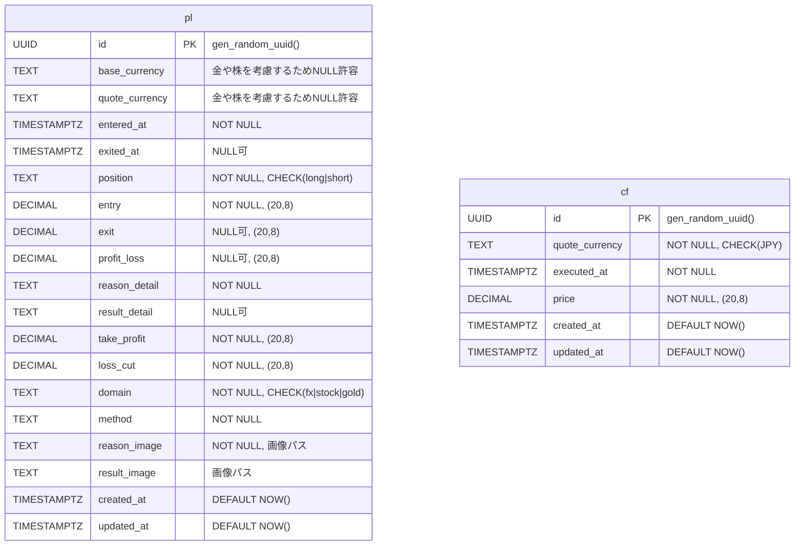

# PLテーブルスキーマ

```mermaid
erDiagram
    pl {
        UUID id PK "gen_random_uuid()"
        TEXT base_currency "金や株を考慮するためNULL許容"
        TEXT quote_currency "金や株を考慮するためNULL許容"  
        TIMESTAMPTZ entered_at "NOT NULL"
        TIMESTAMPTZ exited_at "NULL可"
        TEXT position "NOT NULL, CHECK(long|short)"
        DECIMAL entry "NOT NULL, (20,8)"
        DECIMAL exit "NULL可, (20,8)"
        DECIMAL profit_loss "NULL可, (20,8)"
        TEXT reason_detail "NOT NULL"
        TEXT result_detail "NULL可"
        DECIMAL take_profit "NOT NULL, (20,8)"
        DECIMAL loss_cut "NOT NULL, (20,8)"
        TEXT domain "NOT NULL, CHECK(fx|stock|gold)"
        TEXT method "NOT NULL"
        TEXT reason_image "NOT NULL, 画像パス"
        TEXT result_image "画像パス"
        TIMESTAMPTZ created_at "DEFAULT NOW()"
        TIMESTAMPTZ updated_at "DEFAULT NOW()"
    }

    cf {
        UUID id PK "gen_random_uuid()"
        TEXT quote_currency "NOT NULL, CHECK(JPY)"
        TIMESTAMPTZ executed_at "NOT NULL"
        DECIMAL price "NOT NULL, (20,8)"
        TIMESTAMPTZ created_at "DEFAULT NOW()"
        TIMESTAMPTZ updated_at "DEFAULT NOW()"      
    }
```